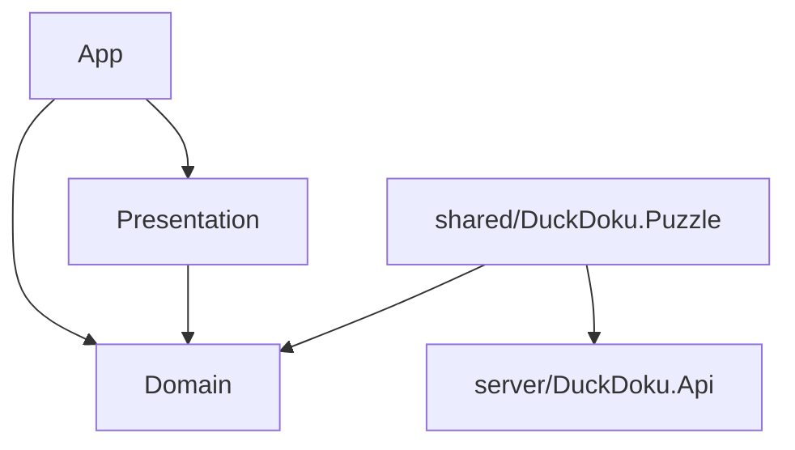

<a name="readme-top"></a>

# DuckDoku

Мобильная головоломка: клон механики Meowdoku («Queens») с
серверно-авторитетной метой на собственном бэкенде.

DuckDoku — pet-проект, в первую очередь площадка для отработки слоистой
клиент-серверной архитектуры: игровые правила живут в общей библиотеке,
которую компилируют и Unity-клиент, и ASP.NET-бэкенд, а весь прогресс и
экономика авторитетно считаются на сервере. Проект в активной
разработке — контент и механики продолжают дополняться.

[](https://ksmk99.itch.io/duckdoku)

<details>
<summary>Оглавление</summary>

- [О игре](#о-игре)
- [Функционал](#функционал)
- [Технологии](#технологии)
- [Архитектура](#архитектура)
- [Запуск проекта](#запуск-проекта)

</details>

## О игре

Поле `N × N`, разбитое на `N` связных цветных областей. Нужно расставить
ровно `N` уток так, чтобы:

1. в каждой строке была ровно одна утка;
2. в каждом столбце была ровно одна утка;
3. в каждой цветной области была ровно одна утка;
4. никакие две утки не стояли в соседних клетках, включая диагональ.

Каждая головоломка сгенерирована так, что имеет ровно одно решение и
решается логикой, без перебора.

<p align="right">(<a href="#readme-top">наверх</a>)</p>

## Функционал

- Ввод двумя жестами: зажатый палец красит/стирает крестики-пометки,
  двойной тап ставит утку
- Неверная утка необратимо блокирует клетку и стоит одной из трёх
  попыток за раунд
- Карточки правил над доской — примеры прямо во время игры
- 100 уровней, сложность растёт от 6×6 до 10×10
- Подсказки — расходуемый ресурс, докупается за валюту
- Энергия с регеном по серверному времени — ограничивает число попыток
  подряд
- Гостевой аккаунт по device id, без регистрации

<p align="right">(<a href="#readme-top">наверх</a>)</p>

## Технологии

**Клиент**

[](https://unity.com/)
[](https://github.com/modesttree/Zenject)
[](https://github.com/Cysharp/UniTask)
[](https://dotween.demigiant.com/)

**Сервер**

[](https://dotnet.microsoft.com/)
[](https://learn.microsoft.com/ef/core)
[](https://www.postgresql.org/)

<p align="right">(<a href="#readme-top">наверх</a>)</p>

## Архитектура



| Сборка | Что внутри |
| --- | --- |
| `Domain` | правила игры и состояние поля — чистый C#, без Unity API |
| `Presentation` | вью, анимации, обработка ввода |
| `App` | сцены, DI (Zenject), сетевые клиенты к серверу |
| `shared/DuckDoku.Puzzle` | генератор и валидатор головоломки — общий для клиента и сервера |

Сервер — ASP.NET Core Minimal API поверх EF Core/PostgreSQL: прогресс по
уровням, энергия, подсказки и валюта считаются на сервере, клиент только
отображает состояние.

<p align="right">(<a href="#readme-top">наверх</a>)</p>

## Запуск проекта

Нужны: Unity Hub (редактор **6000.3.13f1**), **.NET 10 SDK**, **Docker**.

### Сервер

```bash
cp .env.example .env        # задать POSTGRES_PASSWORD
docker compose up -d        # поднять PostgreSQL
```

Создать `server/src/DuckDoku.Api/appsettings.Development.local.json`
(в `.gitignore`, в репозитории его нет):

```json
{
  "ConnectionStrings": {
    "Database": "Host=localhost;Port=5432;Database=duckdoku;Username=duckdoku;Password=<тот же пароль, что в .env>"
  }
}
```

```bash
dotnet run --project server/src/DuckDoku.Api
```

Поднимется на `http://localhost:5190` (миграции — автоматически),
документация API — `/scalar`.

### Клиент

Открыть `client/` в Unity Hub (редактор 6000.3.13f1).

По умолчанию клиент настроен на прод-сервер. Чтобы подключить его к
локальному — в `Assets/Game/Resources/ProjectContext.prefab`
переключить `Server Config` на `Server Config Local`.

<p align="right">(<a href="#readme-top">наверх</a>)</p>
