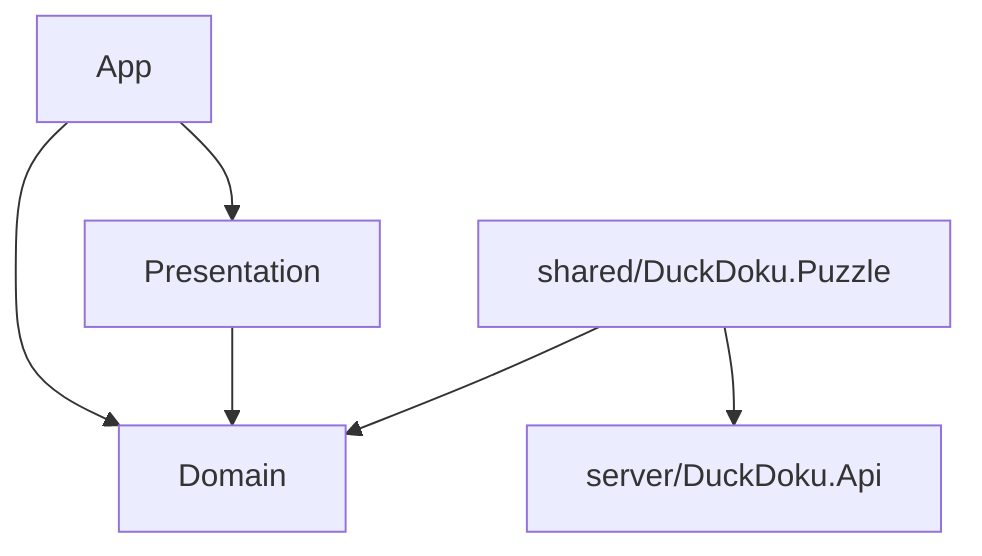

<a name="readme-top"></a>

**English** | [Русский](README.ru.md)

# DuckDoku

A mobile puzzle game: a clone of the Meowdoku ("Queens") mechanic with
a server-authoritative meta layer on a custom backend.

DuckDoku is a pet project, primarily a playground for practicing a
layered client-server architecture: the game rules live in a shared
library compiled by both the Unity client and the ASP.NET backend, and
all progress and economy are computed authoritatively on the server.
The project is under active development — content and mechanics keep
growing.

[](https://ksmk99.itch.io/duckdoku)

<details>
<summary>Table of contents</summary>

- [About the game](#about-the-game)
- [Features](#features)
- [Tech stack](#tech-stack)
- [Architecture](#architecture)
- [Running the project](#running-the-project)
- [Level generation](#level-generation)
- [Dev cheats](#dev-cheats-editor-only)

</details>

## About the game

An `N × N` board split into `N` connected colored regions. Place
exactly `N` ducks so that:

1. every row has exactly one duck;
2. every column has exactly one duck;
3. every colored region has exactly one duck;
4. no two ducks are adjacent, including diagonally.

Every puzzle is generated to have exactly one solution and to be
solvable by logic alone, without brute-force search.

<p align="right">(<a href="#readme-top">back to top</a>)</p>

## Features

- Two-gesture input: holding a finger paints/erases cross marks,
  double-tap places a duck
- A wrong duck permanently blocks the cell and costs one of three
  attempts per round
- Rule cards above the board — examples shown live during play
- 100 levels, difficulty scales from 6×6 to 10×10
- Hints — a consumable resource, purchasable with currency
- Energy that regenerates on server time — caps how many attempts you
  can make in a row
- Guest account by device id, no registration required

<p align="right">(<a href="#readme-top">back to top</a>)</p>

## Tech stack

**Client**

[](https://unity.com/)
[](https://github.com/modesttree/Zenject)
[](https://github.com/Cysharp/UniTask)
[](https://dotween.demigiant.com/)

**Server**

[](https://dotnet.microsoft.com/)
[](https://learn.microsoft.com/ef/core)
[](https://www.postgresql.org/)

<p align="right">(<a href="#readme-top">back to top</a>)</p>

## Architecture



| Assembly | What's inside |
| --- | --- |
| `Domain` | game rules and board state — plain C#, no Unity API |
| `Presentation` | views, animations, input handling |
| `App` | scenes, DI (Zenject), network clients to the server |
| `shared/DuckDoku.Puzzle` | puzzle generator and validator — shared between client and server |

The server is an ASP.NET Core Minimal API on top of EF Core/PostgreSQL:
level progress, energy, hints, and currency are all computed on the
server; the client only renders state.

<p align="right">(<a href="#readme-top">back to top</a>)</p>

## Running the project

Required: Unity Hub (editor **6000.3.13f1**), **.NET 10 SDK**,
**Docker**.

### Server

```bash
cp .env.example .env        # set POSTGRES_PASSWORD
docker compose up -d        # bring up PostgreSQL
```

Create `server/src/DuckDoku.Api/appsettings.Development.local.json`
(gitignored, not present in the repo):

```json
{
  "ConnectionStrings": {
    "Database": "Host=localhost;Port=5432;Database=duckdoku;Username=duckdoku;Password=<same password as in .env>"
  }
}
```

```bash
dotnet run --project server/src/DuckDoku.Api
```

Comes up on `http://localhost:5190` (migrations run automatically),
API docs at `/scalar`.

### Client

Open `client/` in Unity Hub (editor 6000.3.13f1).

By default the client is configured for the production server. To
point it at your local server — in
`Assets/Game/Resources/ProjectContext.prefab` switch `Server Config` to
`Server Config Local`.

<p align="right">(<a href="#readme-top">back to top</a>)</p>

## Level generation

The `content/levels/catalog.json` catalog isn't hand-edited — it's
baked by the console tool `tools/level-baker`. Generation is
deterministic (a fixed master seed), so re-running it without changing
the progression produces the same catalog.

Level progression is defined as buckets of
`(size, difficulty, count)` in
`tools/level-baker/Core/ProgressionPlan.cs`:

| Size | Difficulty | Count |
| --- | --- | --- |
| 6×6 | Easy | 10 |
| 7×7 | Easy / Normal | 8 / 7 |
| 8×8 | Normal | 25 |
| 9×9 | Normal / Hard | 15 / 15 |
| 10×10 | Hard | 20 |

To add levels — add a bucket and re-bake the catalog:

```bash
dotnet run --project tools/level-baker
```

Each puzzle is generated via `DuckDoku.Puzzle.PuzzleGenerator` and
checked by the solver: if the solution isn't unique, the candidate is
discarded and the generator tries again (up to 2000 attempts per
level, otherwise the tool fails with an error). The level's reward is
computed in `RewardPolicy` based on size and difficulty.

By default the tool writes to `content/levels/catalog.json`; a
different path can be passed as the first argument.

<p align="right">(<a href="#readme-top">back to top</a>)</p>

## Dev cheats (editor only)

All cheats are wrapped in `#if UNITY_EDITOR` — they don't physically
exist in the built game (including the itch.io build), only when
running from the Unity Editor.

| Hotkey | Effect |
| --- | --- |
| `Space` | instantly solve the current level |
| `Ctrl` + `Shift` + `E` | max energy |
| `Ctrl` + `Shift` + `Space` | +1000 currency |

The energy and currency cheats call dev endpoints on the server
(`/api/v1/dev/energy/max`, `/api/v1/dev/currency/grant`), which the
server only registers when `ASPNETCORE_ENVIRONMENT=Development` —
meaning these two hotkeys only work against a local server running in
dev mode; the endpoints simply don't exist in production. The
instant-solve cheat works independently of the server.

<p align="right">(<a href="#readme-top">back to top</a>)</p>
